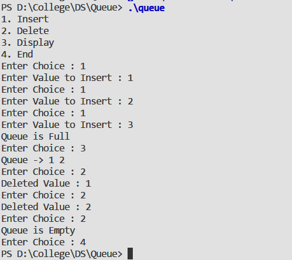

#### Objective:

Write a program to implement a **Queue Operations** using a Array as a Queue.

#### Code :

```cpp
#include <stdio.h>
#define MAXQ 2

typedef struct queue {
    int A[MAXQ] ;
    int front , rear ;
} queue ;

void insertq( queue* , int);
int deleteq( queue* );
void displayq( queue);
void initialize( queue* );

int main(){
    queue q ;
    int ch , n ;
    initialize(&q);
    printf("1. Insert \n");
    printf("2. Delete \n");
    printf("3. Display \n");
    printf("4. End \n");
    do{
        printf("Enter Choice : ");
        scanf("%d" , &ch );
	switch(ch) {
            case 1 :
            printf("Enter Value to Insert : ");
            scanf("%d" , &n);
            insertq(&q , n);
            break;
            case 2 :
            n = deleteq(&q);
            if(n == -1) break;
            printf("Deleted Value : %d \n" , n );
            break;
            case 3 :
            displayq(q);
            break;
        }
    } while ( ch != 4) ;    
}

void initialize(queue *Q){
    Q->front = 0;
    Q->rear = 0;
}

void insertq( queue *Q , int x ){

    if( Q->rear == MAXQ ){
        printf("Queue is Full \n");
        return;
    }   
    Q->A[Q->rear++] = x ;        
}

int deleteq( queue *Q ){
    int x ;
    if( Q->front == Q->rear ){
        printf("Queue is Empty \n");
        return(-1);
    }
    x = Q->A[Q->front++] ;
    return(x);
}

void displayq( queue Q ){
    printf("Queue -> ");
    for(int i = Q.front ; i < Q.rear ; i++ ){
        printf("%d " , Q.A[i]);
    }  
    printf("\n");
    
}
```

#### Output : 



