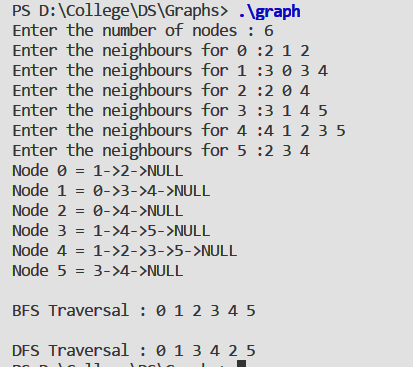

#### Objective:

To implement a Graph using Adjacency List and perform Breadth First and Depth First Search 

#### Code :

```cpp
#include<stdio.h>
#include<stdlib.h> 
struct node {
    int data;
    int status; struct node *next;
};

struct node *root=NULL;

void createGraph(struct node *adj[10],int n) {
    struct node *last; 
    int m,val,d;
    for(int i=0; i<n; i++) {
        printf("Enter the neighbours for %d :",i);
        scanf("%d",&m);
        for(int j=0; j<m; j++) {
            scanf("%d",&val);
            struct node *temp= malloc(sizeof(struct node));
            temp->data=val; 
            temp->next=NULL; 
            if(adj[i]==NULL) {
                adj[i]=temp;
            } else {
                last->next=temp; 
            }
            last=temp; 
        }
    }
}

void Display(struct node *adj[10],int n) {
    for(int i=0; i<n; i++) {
        struct node *temp; temp=adj[i]; 
        printf("Node %d = ",i); while(temp!=NULL)
        {
            printf("%d->",temp->data); temp=temp->next;
        }
        printf("NULL\n");
    }
}

void bfs(struct node *adj[10],int n,int *parent) {
    int queue[n];
    int visited[n]; 
    for(int i=0; i<n; i++) {
        visited[i]=0; 
    }
    int front,rear; 
    front=rear=-1; 
    queue[rear++]=0; 
    visited[0]=1; 
    parent[0]=-1; 
    
    while(rear!=front) {
        int x=queue[front++];
        printf("%d ",x);
        struct node *temp=adj[x]; 
        while(temp!=NULL) {
            if(visited[temp->data]==0) {
                queue[rear++]=temp->data; 
                visited[temp->data]=1; 
                parent[temp->data]=x;
            }
            temp=temp->next; 
        }
    }
    printf("\n"); 
    
}
void dfs(struct node *adj[10],int n,int *visited) {
    struct node *temp; 
    visited[n]=1; 
    printf("%d ",n); 
    temp=adj[n]; 
    while(temp!=NULL) {
        if(visited[temp->data]==0) {
            dfs(adj,temp->data,visited);
        }
        else {
            temp=temp->next;
        }
    }
}
int main() {
    int v;
    printf("Enter the number of nodes : ");
    scanf("%d",&v); 
    struct node *adj[10];
    for(int i=0; i<v; i++) {
        adj[i]=NULL; 
    }
    createGraph(adj,v);
    int p[v];
    
    Display(adj,v);
    
    printf("\nBFS Traversal : "); 
    bfs(adj,v,p); 
    
    int visited[10]= {0};
    printf("\n");
    printf("DFS Traversal : ");
    dfs(adj,0,visited);
    return 0;
}
```

#### Output : 




