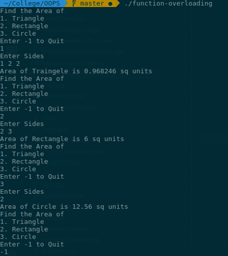

#### Aim:
To understand the concept of **Function Overloading** with the help of on example to compute the area of recatangle . triangle and circle

#### Theory:
Function overloading (also method overloading) is a programming concept that allows programmers to define two or more functions with the same name and in the same scope.

Each function has a unique signature (or header), which is derived from:

- function/procedure name
- number of arguments
- arguments' type
- arguments' order

Since functions' names are in this case the same, we must preserve uniqueness of signatures, by changing something from the parameter list (last three alienees). If the functions' signatures are sufficiently different, the compiler can distinguish which function was intended to be used at each occurrence. This process of searching for the appropriate function is called function resolution and can be quite an intensive one, especially if there are a lot of equally named functions. Programming languages supporting implicit type conventions usually use promotion of arguments (i.e. type casting of integer to floating-point) when there is no exact function match. The demotion of arguments is rarely used. When two or more functions match the criteria in function resolution process, an ambiguity error is reported by compiler. Adding more information for the compiler by editing the source code (using for example type casting), can address such doubts.

#### Syntax :

```cpp
int test() { }
int test(int a) { }
float test(double a) { }
int test(int a, double b) { }
```

#### Code :

```cpp
#include <iostream> 
#include <math.h>
using namespace::std ;


float area( int a , int b , int c ) {
    float s = (a+b+c)/2.0 ;
    return sqrt(s*(s-a)*(s-b)*(s-c)) ;
}

float area(int l , int b){
    return l * b ;
}

float area( int radius) {
    return 3.14 * radius * radius ;
}

int main () {

    cout << area(5,12,13) << endl ;
    cout << area(1,2) << endl ;
    cout << area(1) << endl ;

}
```

#### Output : 
 

#### Discussion :
The above program illustrates the concept of function overloading where the function `area` is overloaded  to find the area of a triangle, rectangle or circle depeding upon the number of arguments given to it. 
The area of triangle s calculated using Heron's Formula. Each `area` function has a unique singnature which helps the complier to resolve which function to call.

#### Learing Outcomes :
 - Function Overloading enables consistency in the naming of methods / functions which logically perform very similar tasks, and differ slightly in by accepting different parameters. This allows the same method name to be reused across multiple implementations. 
 - Consistency in notation, which is good both for reading and for writing code


