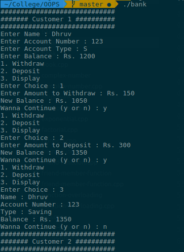

#### Aim:
To understand the concept of **Classes** with the help of on example.
#### Theory:
The building block of C++ that leads to Object Oriented programming is a Class. It is a user defined data type, which holds its own data members and member functions, which can be accessed and used by creating an instance of that class. A class is like a blueprint for an object.
An Object is an instance of a Class. When a class is defined, no memory is allocated but when it is instantiated (i.e. an object is created) memory is allocated.
A class is defined in C++ using keyword `class` followed by the name of class. The body of class is defined inside the curly brackets and terminated by a semicolon at the end.

#### Syntax :

```cpp
class class_name {
  access_specifier_1:
    member1;
  access_specifier_2:
    member2;
  ...
} ;

// Initializing

class_name object_name ;

```

#### Code :

```cpp
#include <iostream> 

using namespace::std;

class Customer {
    char name[50] ;
    double account_number ;
    char account_type ;
    float balance ;

    public :

    void input() {
        cin.clear();   
        cout << "Enter Name : " ;
        cin.getline(name , 50 , '\n' ) ;
        cout << "Enter Account Number : " ;
        cin >> account_number ; 
        cout << "Enter Account Type : " ;
        cin >> account_type ;
        cout << "Enter Balance : Rs. " ;
        cin >> balance ;
    }

    void display() {

        cout << "Name : " << name << endl ;
        cout << "Account Number : " << account_number << endl ;
        if (account_type == 'S' ) {
            cout << "Type : Saving" << endl ;
        } else {
            cout << "Type : Current" << endl ;
        }
        cout << "Balance : Rs. " << balance << endl ;
    }

    void deposit(){
        int amount ;
        cout << "Enter Amount to Deposit : Rs. " ;
        cin >> amount ;
        balance += amount ;
        cout << "New Balance : Rs. " << balance << endl ;
    }
    void withdraw() {
        int amount ;
        cout << "Enter Amount to Withdraw : Rs. " ;
        cin >> amount ;
        if ( balance - amount < 1000) {
            cout << "Insufficient Balance " << endl ;
            return ;
        }
        balance -= amount ;
        cout << "New Balance : Rs. " << balance << endl ;
    }
};

int main () {

    Customer customers[10] ;
    int choice;
    char cont ;

    for( int i = 0 ; i < 10 ; i++ ) {

        cout << "#############################\n" ;
        cout << "####### Customer " << i + 1 << " ##########\n" ;
        cout << "#############################\n" ;
        
        customers[i].input();
        while(1) {
            cout << "1. Withdraw" << endl ;
            cout << "2. Deposit" << endl ;
            cout << "3. Display" << endl ;
            cout << "Enter Choice : ";
            cin >> choice ;
            if (choice == 1 ) { 
                customers[i].withdraw() ;
            } else if (choice == 2 ) {
                customers[i].deposit() ;
            } else if (choice == 3 ) { 
                customers[i].display() ;
            } else {
                cout << "Invalid Choice" << endl ;
            }
            cout << "Wanna Continue (y or n) : " ;
            cin >> cont ;
            cin.clear();
            if (cont == 'n' || cont == 'N') {
                break;
            }
        }        
    }
    
    return 0 ;
    
}
```

#### Output : 
 

#### Discussion :
The program stimualtes a simple queue of 10 people in bank,  where I person can withdraw , deposit cash in account or display the details of its account. The process is stumulated using the concept of classes where each Customer is represented by an Object. All the related data to customer and functions like display are encaplusated within the `Customer` class. 

#### Learing Outcomes :
 - Classes are a way to organize your code into generic, reusable peices. At their best they are generic blueprints for things that will be used over and over again with little modification. 
 - Classes use Data Hiding and Encapsulation and knowledge of its implementation is not necessary for its use. 
 - Classes can restrict access to data, removing bug-opportunities that direct access could give.
 


